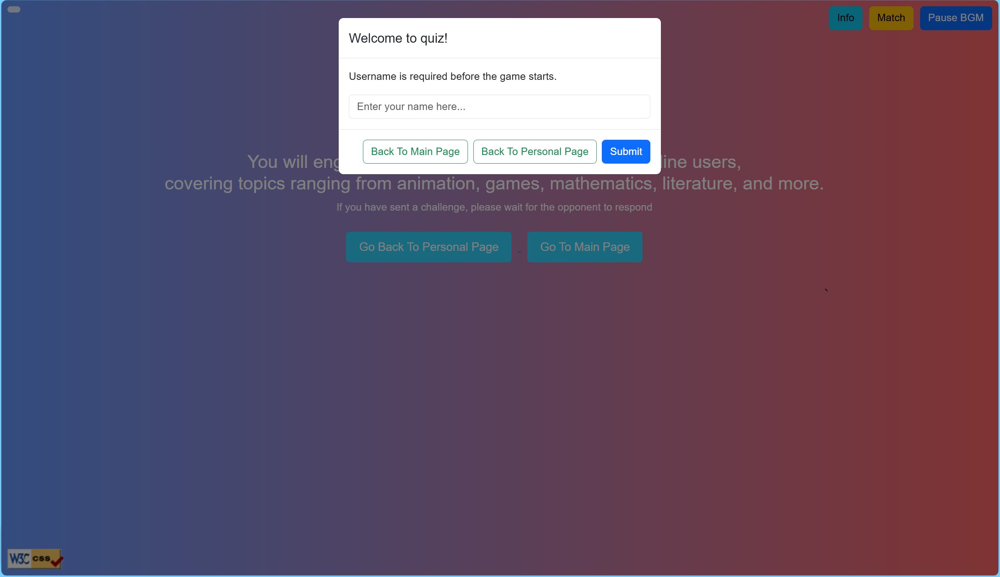

<h1>Nova - Web Application Development Project Report</h1>
<h2>1.Overall Design</h2>

This is a multiplayer online battle platform that uses HTML/CSS+Bootstrap to build a responsive front-end interface, implements the back-end based on the Node.js+Express server framework, and utilizes Socket.io for real-time communication.
 
 Specifically, <a href=".Server/public/introduction_page.html">Introduction Page</a> and <a href=".Server/public/personal_page.html">about page</a> are static pages created using HTML and CSS,
  
 while quiz application page is an interactive web page built on a server using the combination of Node.js and Express frameworks, utilizing real-time communication through Socket.IO.
 
 The core function of this website is real-time knowledge battle for two people, supporting users to customize usernames, challenge online players, complete 5 rounds of questions and dynamically score based on accuracy and response time, supplemented by simple navigation interaction. Technical highlights include real-time communication (topic broadcasting, score reflection, etc.) and simple CSS animation effects. In addition, I try to modularize the website to make it expandable, such as dynamically adding question banks and BGM resources, and flexibly adjusting battle rules through configuration files. Referring to the well-known game Clash Royale, the battle program I designed focuses on lightweight real-time competition and strives to achieve a balance of personalized display.

<h2>2.Technical Architecture</h2>
<h3>2.1 Client Technology Architecture</h3>
<h4>2.1.1 Technical Support</h4>
<pre><code class="html">&lt;script src="https://cdn.socket.io/4.5.4/socket.io.min.js"&gt;&lt;/script&gt;
&lt;link rel="stylesheet" href="https://cdn.jsdelivr.net/npm/bootstrap@5.3.5/dist/css/bootstrap.min.css"&gt;
</code></pre>
<h4>2.1.2 The Use Of Modal Class</h4>

In the development process, the widespread use of modal boxes is essential due to the existence of many user interaction processes.
 Here are some modal boxes used in the development process:

<pre><code class="html">&lt;div class="modal fade" id="genericModal" tabindex="-1" aria-labelledby="genericModalLabel"&gt;
    &lt;div class="modal-dialog"&gt;
        &lt;div class="modal-content"&gt;
            &lt;div class="modal-header"&gt;
                &lt;h5 class="modal-title" id="genericModalLabel"&gt;ATTENTION&lt;/h5&gt;
                &lt;button type="button" class="btn-close" data-bs-dismiss="modal" aria-label="Close"&gt;&lt;/button&gt;
            &lt;/div&gt;

            &lt;div class="modal-body" id="modalBody"&gt;
                &lt;!-- Custom Content --&gt;
            &lt;/div&gt;
                &lt;div class="modal-footer"&gt;
                &lt;button type="button" class="btn btn-primary" id="general_button"&gt;OK&lt;/button&gt;
            &lt;/div&gt;
        &lt;/div&gt;
    &lt;/div&gt;
&lt;/div&gt;
</code></pre>

During the use of the website, users can see its presence from customizing their name to the end of the game.
 

<h4>2.1.3 Real Time Battle Interface</h4>

After users customize their username, they will see the following page. As the homepage of the battle program, this page follows the principle of simplification and does not add too much content, only a simple game introduction, supplemented by two sets of navigation buttons.
 
 There are three buttons fixed in the upper right corner of the screen that are responsible for different functions. The homepage does not provide a detailed introduction to the game, and the info button in the upper right corner of the screen is designed to compensate for this drawback. Click the button to view detailed game rules.
 
 After users customize their usernames, the website allows them to choose online users for challenges, but this is not something that needs to be done immediately. They can close the matching interface and explore the page more. When they have learned about the overall game and decided to participate in the battle, the yellow Match button in the upper right corner allows them to search for all online players and challenge them. Of course, they can refresh the matching interface to obtain the latest online information.
 
 In order to optimize the user's interactive experience during the battle process, the battle webpage has undergone some artistic design while ensuring the complete availability of basic functions (such as timers, answering questions, display status, etc.).
 I have prepared different background music for different stages of the battle program and allow users to control it by clicking the button in the upper right corner. The battle page has also been adjusted to better align with the concept of &ldquo;online two player battles&rdquo;.
 

<h4>2.1.4 Dynamic Question Loader</h4>

In order to simplify the interaction between the server and the client, I pre-set all questions and correct answers on the client. In this way, the communication burden between the server and the client will be reduced because there is no need to transmit information such as images and text. The server only needs to broadcast signals to the client to load question information to the user and make judgments on the user's answers locally. After each answer is completed, the client only needs to return the username and answer status (correct or incorrect, answer time) to the server. The scoring situation is judged and stored by the server through corresponding logic.

<h3>2.2 Server Architecture</h3>
<h4>2.2.1 Basic Framework</h4>

Express can handle static resources and basic HTTP requests, while Socket.IO establishes a bidirectional real-time communication channel. The hybrid architecture of the two can support both RESTful API and WebSocket connections simultaneously.

<pre><code class="javascript">const express = require('express');
const socketIo = require('socket.io');
const http = require('http');

const app = express();
const server = http.createServer(app);
const io = socketIo(server);
</code></pre>
<h4>2.2.2 State Management Model</h4>

After consideration, I believe that using sessions and queues to manage user status is appropriate.

<pre><code class="javascript">let users = {};          // {socket.id: username}
let matches = new Map(); // Map&lt;matchKey, status&gt;
let games = {};          // {matchKey: sessionData}

const game_settings = {
  question_count: 5,     
  round_rest: 5000,    
  answerTimeout: 10000 
};
</code></pre>
<h4>2.2.3 Connect Lifecycle Management</h4>

In order to achieve online interaction, I choose to use Socket ID to establish a mapping relationship between user sessions and sockets for binding. Of course, I also introduced an automatic cleaning mechanism to maintain the online user list in real-time.

<pre><code class="javascript">io.on('connection', (socket) =&gt; {
  socket.on('setUsername', (username) =&gt; {
    users[socket.id] = username;
    console.log(`User ${username} connected.`);
  });

  socket.on('disconnect', () =&gt; {
    delete users[socket.id];
  });
});
</code></pre>
<h4>2.2.4 Based On Event Driven</h4>

Realize full process control of the game through 12 custom Socket events.

<pre><code>   start_challenge 
-&gt; receive_challenge
-&gt; accept_challenge 
-&gt; players_matched 
-&gt; game_start 
-&gt; submit_result 
-&gt; round_complete 
-&gt; game_over
</code></pre>
<h4>2.2.5 Match Engine</h4>

In order to fully respect the wishes of users, I used the mechanism of Internet protocol communication for reference, and designed the match system for the war as a way of &ldquo;one side initiates an application - the other side accepts/rejects&rdquo;.

<pre><code class="javascript">socket.on('start_challenge', (from_name, to_name) =&gt; {
  const target_id = Object.keys(users).find(k =&gt; users[k] === to_name);
  if(target_id) {
    io.to(target_id).emit('receive_challenge', {
      from: from_name,
      message: `New challenge from ${from_name}!`
    });
  } else {
    socket.emit('not_online', `${to_name} is offline`);
  }
});

socket.on('accept_challenge', (acceptor, challenger) =&gt; {
  const match_key = [acceptor, challenger].sort().join(':');
  games[match_key] = {
    current_question: 0,
    scores: { [acceptor]: 0, [challenger]: 0 }
  };
});
</code></pre>
<h4>2.2.6 Real Time Answering System</h4>

According to the given requirements, the following is the implementation answer system that I have designed.

<pre><code class="javascript">socket.on('submit_result', (data) =&gt; {
  const match_key = [data.player, data.opponent].sort().join(':');
  const session = games[match_key];

  session.results[data.player] = {
    is_correct: data.is_correct,
    response_time: data.response_time
  };

  if(Object.keys(session.results).length === 2) {
    processRoundResults(match_key, session);
  }
});

function processRoundResults(match_key, session) {
  const [p1, p2] = Object.keys(session.scores);
  const r1 = session.results[p1], r2 = session.results[p2];

  if(r1.is_correct &amp;&amp; r2.is_correct) {
    session.scores[r1.response_time &lt; r2.response_time ? p1 : p2] += 2;
  } else if(r1.is_correct) {
    session.scores[p1] += 2;
  } else if(r2.is_correct) {
    session.scores[p2] += 2;
  }
}
</code></pre>
<h3>2.3 Communication Mechanism Design</h3>
<h4>2.3.1 Core Communication Architecture</h4>

As mentioned earlier, the website is built on the framework of Node.js+Express and uses Socket.IO for communication. After installing the corresponding suite on both the client and server, the client can easily establish a connection with the server.

<pre><code class="javascript">// Client
const socket = io();
socket.on('connect', () =&gt; {
  console.log('Connected to server');
});

// Server
io.on('connection', (socket) =&gt; {
  socket.on('setUsername', (username) =&gt; {
    users[socket.id] = username; 
  });
});
</code></pre>
<h4>2.3.2 Key Event Process</h4>

Based on the theoretical knowledge of software engineering, I have been modeling the communication between the client and server since the programming stage. The following is a sketch of the design phase.
 
 The final code implementation of the key process is shown in the figure

<h5>Challenge Initialization</h5>
<pre><code class="javascript">// Client Initiate A New Challenge
document.querySelector('.challenge-btn').addEventListener('click', () =&gt; {
  socket.emit('start_challenge', fromUser, toUser);
});

// Server Send Request To Target Client
socket.on('start_challenge', (from, to) =&gt; {
  const targetSocket = findUserSocket(to);
  io.to(targetSocket).emit('receive_challenge', { from, to });
});
</code></pre>
<h4>Match Synchronization</h4>
<pre><code class="javascript">// Client Subit Answers
function handleAnswer(selectedIndex) {
  socket.emit('submit_result', {
    player: username,
    opponent: oppoName,
    is_correct: checkCorrect(selectedIndex),
    response_time: Date.now() - startTime
  });
}

// Server Handle Results
function processRoundResults(session) {
  if (session.results[playerA].response_time &lt; session.results[playerB].response_time) {
    session.scores[playerA] += 2;
  }
  io.emit('round_complete', session.scores); 
}
</code></pre>
<h3>2.4 Other Funtions</h3>
<h4>Exception Handling</h4>
<pre><code class="javascript">// User Offline Detection
socket.on('disconnect', () =&gt; {
  delete users[socket.id];
  cleanupMatches(socket.id); 
});

// Challenge Exception Handling
socket.on('reject_challenge', () =&gt; {
  showModal('Challenge Rejected!');
});
</code></pre>
<h4>Audio Interaction</h4>

Different music will be played in different scenarios, depending on the situation.

<pre><code class="html">&lt;audio id="bgm" autoplay loop&gt;
  &lt;source src="/music/Battle.mp3"&gt;
&lt;/audio&gt;

&lt;script&gt;
function switchBGM(winner) {
  const audio = winner ? winner_bgm : loser_bgm;
  bgm.pause();
  audio.play();
}
&lt;/script&gt;
</code></pre>
<h2>3.Reflection And Improvement</h2>

I have to say that this is the most difficult course assignment I have encountered so far. Although I had prepared myself mentally in advance, I still found myself overwhelmed when it came to the development phase. From reading the project requirements to just finishing the entire website, and even now, at the end of writing the project report, it has been six and a half days. Fortunately, before starting this project, I added a timer on my PC to record the time I spent on it because this project seemed very challenging (and it indeed was). I was curious about how long it would take me to complete. The cold computer doesn't lie. According to the statistics, up to this point, I've spent 40 hours, 19 minutes, and 37 seconds on the project, which means that I've spent over 6 hours a day on website development. As the software development process nears its end, I hope to record the difficulties I encountered here and thank them for torturing me for nearly a week.

Let me first talk about front-end development. The front-end development of this project combines HTML/CSS with Bootstrap, supplemented by JavaScript controls. They provide a wide range of components and styles for reference, but I still have to say that finding the right components, defining styles for them, and arranging the pages is far more difficult than I imagined. During this time of front-end development, I kept flipping through my notes and using various search engines to find and design components that satisfied me. Modal windows are one of the examples. After countless attempts, I finally decided to create a versatile modal window for use in various scenarios. Additionally, in the early stages of development, I used a combination of inline and internal CSS, but this resulted in very lengthy code. Although Codio provides an internal search tool, this coding method was not ideal. As the codebase grew, it became increasingly difficult to find the relevant components and clarify their relationships. Predictably, in the middle of development, I spent half a day standardizing the use of CSS to external files and making modifications. What drove me crazy was that many times the problems encountered in the front-end did not return error messages like the back-end. You only know something is wrong, but you have no idea where the mistake lies. The issue with the modal not hiding correctly, causing the page to freeze, troubled me for a long time.

Now, let's talk about back-end development. Compared to front-end development, I think back-end development is slightly easier. The back-end was built using the Express framework on the Node.js platform, with real-time communication achieved through Socket.IO. I modeled the behaviors and interactions of various subjects over time, and the software engineering theory still applied here. Therefore, once the sequence diagram was completed, things became easier. Especially after becoming more proficient with Socket.IO during the middle stage of development, back-end development became increasingly easier. For me, the biggest challenge in back-end development was perhaps my unfamiliarity with the development tools, but that was resolved as the development progressed.

There is no such thing as a perfect creation, and that applies even more to a website built by a beginner. It's not hard to notice that the frequent reuse of modals led to a reduction in the interaction experience, the elements (like fonts) have monotonous styles and designs, the application has limited focus on web security and may be vulnerable to attacks, and the website doesn't integrate with a database, making it unsuitable for large-scale use&hellip; I had many beautiful ideas for this website, but due to various constraints, they weren't realized.

Finally, I must emphasize again that this has been a very exhausting experience, but at the same time, it has been a very meaningful one. Software development is divided into front-end development and back-end development (for now, let me temporarily ignore full-stack development), which is something we are all familiar with. However, in my previous project experiences, I focused mainly on the back-end, that is, the implementation of the underlying logic. I can say that my entire understanding of the front-end came from this four-week learning period. Therefore, compared to the web applications I usually come into contact with, my website is undoubtedly simple and rough, and I'm fully aware of this. I hope the users of this website, or you who are reading this document, can forgive my limited knowledge. But, I'm still willing to accept this work because, after all, it is my first attempt at web application development. I have no intention of forgetting it once the course assignment is over. On the contrary, I am more willing to treat it as an interest project, continuously improving it and growing together with it.

Xianchong Liang
 Beijing Time, February 25, 2025, 14:54
 In South China Normal University NanHai Campus, China

<h2>4.Project Annotations</h2>
<h3>4.1 Project Statistics</h3>

Front end code lines: 800+
 Server code lines: 150+
 Number of questions: 5
 Sound resources: 8 audio files
 Support concurrent battles: 10+matches

<h3>4.2 System Has Passed W3C CSS Validation</h3>

W3C CSS logo can be seen in all pages.

